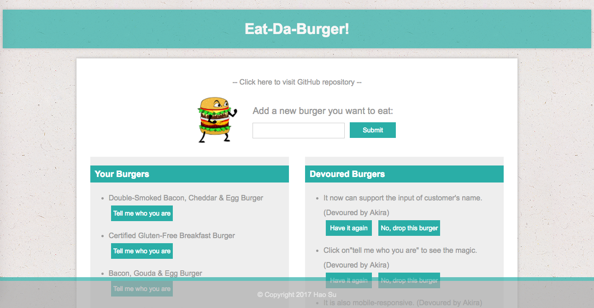
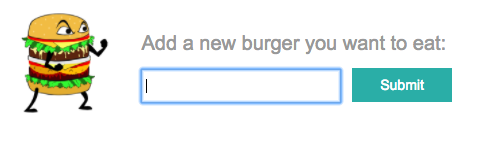
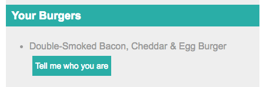
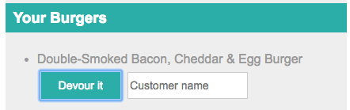
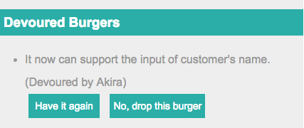

# Eat-Da-Burger

App page: https://eat-da-burger-sequelize-sunny.herokuapp.com/

## Overview

Wanna eat different burgers and attach your name to it? Check this app out!

Database: `MySQL`

Server: `Express.js`

ORM: `Sequelize`

Front-end framework: `Handlebars.js`

### Add a burger

Enter the name of burger you want to devour here and click `Submit`, then the new burger will appear on the left:

### Devour a burger

Click `Tell me who you are` of the burger you want to eat, then type your name in input box and click `Devour it`:

### After devouring a burger

You can re-devour it, or remove it. Simply click the button on the right side, which shows the list of devoured burgers and customers.

## Copyright

Sunny (Hao) Su (C) 2017. All rights reserved.